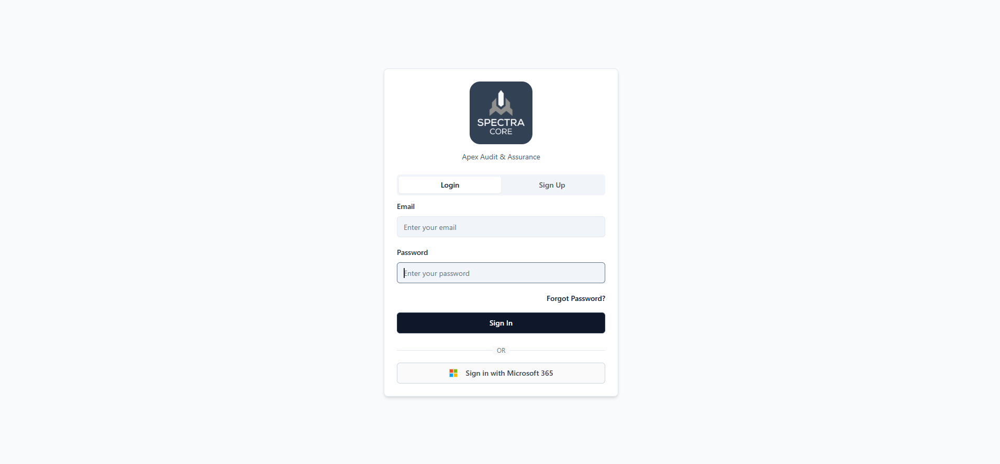

# 🏢 Enterprise Audit & Compliance SaaS Platform

**August 2025 – December 2025**

A multi-tenant SaaS platform designed for enterprise audit and compliance tracking. Built with React, TypeScript, Node.js, Express.js, and Supabase (PostgreSQL), this platform provides role-based workflow management, dynamic dashboards, standards tracking, and user administration – all powered by AI-driven compliance summarisation.

The platform is productionised on DigitalOcean using Docker and a CI/CD pipeline, with automated AWS backups for disaster recovery, delivering a secure, scalable solution for enterprise clients.

---

  

---

## 🧠 How It Works (At a Glance)

The platform supports the entire audit and compliance lifecycle for enterprise organisations:

- **Multi-Tenant Architecture** – A single instance serves multiple enterprise clients with complete data isolation, customisation, and secure access controls.
- **Role-Based Workflow System** – Granular permissions and custom dashboards for auditors, compliance officers, administrators, and standard users.
- **Standards Management** – Centralised tracking of compliance frameworks, audit checklists, and regulatory requirements.
- **User Administration** – Comprehensive user management with role assignment, access control, and activity logging.
- **AI-Powered Reporting** – OpenAI GPT integration automatically generates compliance summaries and detailed reports, dramatically reducing manual reporting effort.
- **Production-Ready Infrastructure** – Deployed on DigitalOcean with Docker containerisation, automated CI/CD pipelines, and scheduled AWS backups for disaster recovery.

---

## 🧰 Technologies Used

| Area | Technologies |
|------|--------------|
| **Frontend** | React, TypeScript |
| **Backend** | Node.js, Express.js |
| **Database** | Supabase (PostgreSQL) |
| **AI / LLM** | OpenAI GPT (compliance summarisation and reporting) |
| **Deployment** | DigitalOcean, Docker |
| **CI/CD** | Automated pipeline |
| **Backup & Recovery** | AWS (automated backups for disaster recovery) |
| **Authentication & Security** | Role-based access control, multi-tenancy |

---

This project demonstrates the successful delivery of a complex, enterprise-grade SaaS solution – combining modern full-stack development, AI integration, and production-grade DevOps practices to solve real-world audit and compliance challenges at scale.
